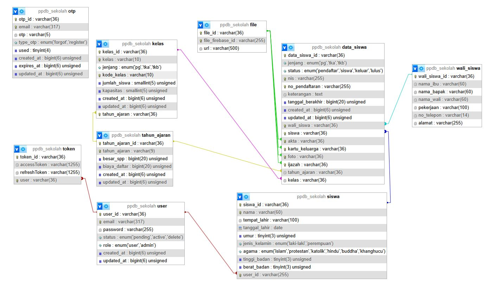

### CLIENT Techstack

- React
- Typescript
- Tailwind CSS
- Mantine UI
- PDFjs
- Redux
- Sonner

### SERVER Techstack

- Nest
- Typescript
- firebase
- mysql
- nodemailer
- otp-generator

### Docs

- API SPECIFICATION : [Klick Here](./API_SPECIFICATION.md)
- VIDEO DEMO & CARA INSTALASI : [Klick Here](https://youtu.be/MtHbJdW8L0I)

### NOTE :

- ubah nama file `.env.example` jadi `.env.local`
- pastikan device terinstall `nodejs` versi `>= v20`

### ERD

